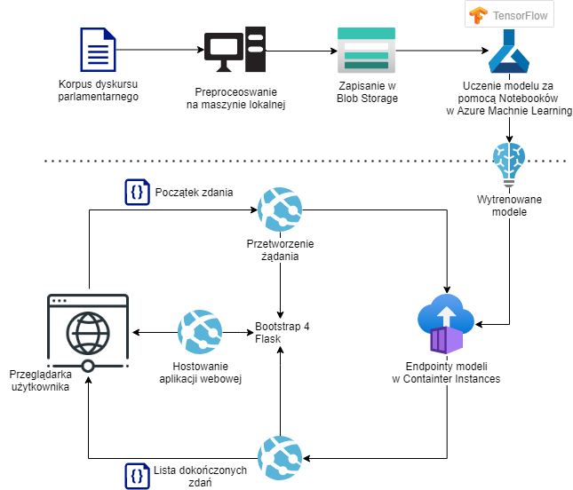
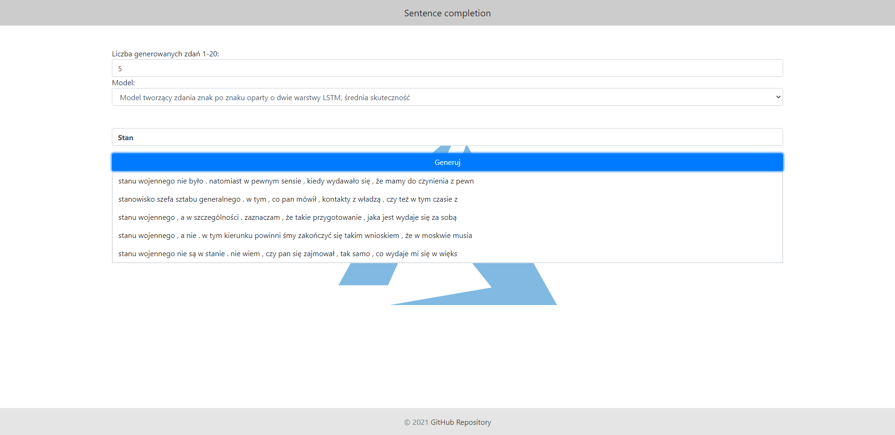

# Dokumentacja

## Sposób użycia

1. Użytkownik otwiera w przeglądarce stronę https://sentencecompletion2020.azurewebsites.net/.
2. Następnie wybiera w odpowiednich polach liczbę zdań do wygenerowania (im więcej, tym dłużej to potrwa) oraz model, który ma wygenerować zdania.
3. W ostatnim polu użytkownik zaczyna pisać zdanie do dokończenia.
4. Po wciśnięciu "Generuj" zostanie wysłane asynchroniczne żądanie do web service'u, który to wyśle żądanie wygenerowania zdań do endpointu wybranego modelu. Po chwili wyniki pojawią się pod przyciskiem.
5. Jeśli użytkownik chce, to może wybrać jedną z wygenerowanych opcji i kontynuować generowanie tekstu.

## Funkcjonalności

* generowanie zdań,
* generowanie słów,
* wybór jednego z kilku modeli,
* wybór liczby zdań do wygenerowania.

## Przebieg projektu

### Analiza zbioru danych

W projekcie został wykorzystany korpus dyskursu parlamentarnego (https://kdp.nlp.ipipan.waw.pl/query_corpus/). Zawiera on dane od roku 1919 do chwili obecnej. Zawiera anotowane lingwistycznie teksty z posiedzeń plenarnych Sejmu i Senatu RP, interpelacji i zapytań poselskich oraz posiedzeń komisji. Z tego względu występuje w nim dużo zamierzchłości językowych oraz skrótów. Zdecydowaliśmy się wykorzystać pliki, w których tekst jest podzielony na zdania, a następnie na słowa. Jest to zapisane w plikach w formacie XML. 

### Przetworzenie korpusu

Aby zmniejszyć rozmiar danych wejściowych do trenowania modeli, przetworzyliśmy dane ze zbioru do plików zawierających po jedno zdanie w linijce ze słowami oddzielonymi spacją - uznaliśmy w tym przypadku znaki interpunkcyjne jako oddzielne słowa, więc przez to w wynikowych zdaniach od modelu przecinki, kropki, dwukropki itp. nie są "przyklejone" do słów. Wykorzystaliśmy do tego pliki ann_segmentation.xml.gz przy poszczególnych posiedzeniach. Dodatkowo, dane wyjściowe stworzone w tej części podzieliliśmy na pliki wielkości około 0,5 GB ze względu na ograniczenia, jakie spotkaliśmy przy używaniu modelu z większymi plikami.

### Trenowanie modelu

#### Wytrenowane modele:

#### -na ciągach znaków:

Model na podstawie otrzymanego ciągu znaków przewiduje następny znak. Wielokrotne wywołanie modelu pozwala na wygenerowanie tekstu. Pierwsza warstwa jest warstwą wejściową (ang. embedding) z wejściem o rozmiarze równym wielkości słownika zawierającego wszystkie znaki polskie i podstawowe znaki interpunkcyjne. W jednym modelu jako warstwę ukrytą zastosowano GRU(RNN), zaś w drugim dwie warstwy ukryte LSTM, każda po 1024 jednostek. Rozmiar został dobrany umownie. Zbyt duży rozmiar powodowałby zwiększenie złożoności modelu i skutkowałoby to zbyt dobrym dopasowaniem do zbioru danych uczących. Model straciłby zdolności uogólniające. Z kolei zbyt mała liczba jednostek mogłaby powodować niedouczenie modelu i słabe wyniki generowania tekstu. Warstwą wyjściową jest warstwa gęsta (ang. dense layer) i pełni rolę warstwy klasyfikującej. Warstwa ostatecznie określa jaki ma być następny znak.

#### -na ciągach wyrazów:

Model na postawie otrzymanego ciągu słów przewiduje następne słowo. Wielokrotne wywołanie modelu pozwala na wygenerowanie tekstu.

Zanim przystąpiono do trenowania modeli, tekst został poddany tokenizacji, czyli każde słowo otrzymało swój własny identyfikator i weszło w skład słownika.

W pierwszym przypadku model trenowany był w całości łącznie z warstwą wejściową (ang. embedding). W drugim przypadku do trenowania modelu wykorzystaliśmy już przetrenowaną warstwę embeddingu na narodowym korpusie języka polskiego i polskiej wikipedii. Do wytrenowania warstwy wejściowej posłużył algorytm Word2Vec,  będący techniką przetwarzania języka naturalnego, służącą do skojarzania podobnych znaczeniowo słów. Pierwsza warstwa jest warstwą wejściową (Embedding) z wejściem o rozmiarze równym wielkości słownika zawierającego wszystkie słowa pojawiające się w tekście. Warstwa ukryta jest typu LSTM (ang. Long Short-Term Memory) o rozmiarze 1024 jednostek. Warstwa wyjściowa jest warstwą gęstą i pełni rolę warstwy klasyfikującej. Warstwa ostatecznie określa jakie ma być następne słowo.

Ze względu na ograniczony czas wszystkie modele były trenowane na losowym niepełnym zestawie dostarczonych danych. W planach było: samodzielne wytrenowanie modelu Word2Vec na zbiorze danych pochodzących z polskiego korpusu parlamentarnego.

### Aplikacja webowa

Aplikacja webowa pozwala użytkownikowi na korzystanie z wytrenowanych modeli. Wykorzystany został do jej stworzenia Flask z Bootstrapem4. Składa się ona z jednej strony, na której użytkownik wybiera liczbę zdań do wygenerowania, jeden z wytrenowanych modeli oraz wpisuje początek zdania w odpowiednie pole. Następnie po kliknięciu przycisku "Generuj" wysyłane jest zapytanie asynchroniczne do aplikacji. Ona następnie je przetwarza i wysyła żądanie nowych zdań do endpointów modeli.

## Podsumowanie

Uważamy, że projekt generalnie zakończył się sukcesem. Udało nam się stworzyć rozwiązanie, które pozwala na generowanie tekstu, sprawdziliśmy też różne metody, zdobyliśmy wiedzę jakie metody. 

Jednak spotkaliśmy się z wieloma problemami wynikającymi z tego, że był to pierwszy raz, gdy korzystaliśmy z chmury oraz TensorFlow. Błędy te były dodatkowo uciążliwe, ponieważ przeważnie trzeba było odczekać minimum kilka minut, aż dany błąd wystąpi, co spowodowało duże straty czasu. Problemy stwarzała także kompatybilność wersji CUDA z TensorFlow.

Innym nieprzyjemnym aspektem projektu były ograniczenia subskrypcji studenckiej. Nie pozwalała nam ona w pełni wykorzystać dostępnych środków. Najlepsze maszyny, które mogliśmy wykorzystać do uczenia maszynowego były realnie słabsze od naszych komputerów osobistych. 