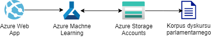

# EY - Text Generation

## **Członkowie zespołu:**

1. Karol Adameczek 299231 
2. Dawid Rawski 299287
3. Robert Martyka 299268

## **Opis projektu:**

Celem projektu jest stworzenie aplikacji uzupełniającej wprowadzone przez użytkownika rozpoczęcie zdania w języku polskim. Tekst będzie generowany przez model uczenia maszynowego, którego wiedza będzie bazować na korpusie dyskursu parlamentarnego. Drugim celem projektu jest przygotowanie propozycji na temat przygotowania i pre-procesowania danych, które mogą pozwolić na uzyskanie lepszych wyników.

**Treść zadania**

Strona 5. https://github.com/ekote/AI-on-Microsoft-Azure/blob/main/intro-inz/projects/EY.pdf

**Zbiór danych:**

[Korpus dyskursu parlamentarnego](https://kdp.nlp.ipipan.waw.pl/)

## Zasada działania

### **Schemat**

1. Użytkownik ładuje stworzoną stronę internetową w przeglądarce,
2. W pole tekstowe wprowadza początek określonego zdania,
   1. strona internetowa za pomocą skryptu wysyła zapytanie o dokończenie aktualnej treści zdania,
   2. na podstawie przesłanej treści wytrenowany model generuje propozycje kolejnych słów i dla najlepszej opcji generuje całe zdanie do końca,
   3. wygenerowana treść jest odsyłana jako odpowiedź na poprzednie zapytanie,

## **Architektura projektu:**

* Azure Machine Learning - wykorzystanie Notebooków do wyuczenia modelu,

* App Services - Web App do hostowania strony internetowej i obsługi zapytań,

* Azure Storage Accounts - dane do machine learningu,

  

## **Stos technologiczny:**

* Python3 
  * Flask
* Javascript
* HTML/CSS
* Notebooki w Azure Machine Learning
* TensorFlow + Keras

## Wymagania

### Wymagania funkcjonalne

* Aplikacja uzupełnia zdania w czasie rzeczywistym (brak przeładowania strony).
* Aplikacja podaje użytkownikowi więcej niż jedną propozycję następnego słowa.
* Aplikacja tworzy zdania oznajmujące, pytające i rozkazujące.
* Do uczenia modelu wykorzystany jest korpus dyskursu parlamentarnego.

### Wymagania niefunkcjonalne

* Wyuczenie modelu uczenia maszynowego do automatycznego uzupełniania zdań.
* Stworzenie aplikacji sieciowej wykorzystującej model.
* Stworzenie dziennika/sprawozdania, w którym zawarte będą informacje na temat wykorzystywanych modeli i ich użyteczności

## Harmonogram

| Lp.  | Data       | Opis                                                         |
| ---- | ---------- | ------------------------------------------------------------ |
| 1.   | 03.12.2020 | Stworzenie opisu projektu, zebranie wymagań                  |
| 2.   | 10.12.2020 | Rozkompresowanie danych z korpusu, preprocesowanie i wczytane dane do Azure Blob Storage (check-point) |
| 3.   | 17.12.2020 | Wykonana analiza zbioru danych, pierwsza iteracja tworzenia aplikacji uczącej model |
| 4.   | 07.01.2021 | Druga iteracja aplikacji                                     |
| 5.   | 14.01.2021 | Aplikacja webowa ładująca poprawnie interfejs użytkownika (check-point) |
| 6.   | 21.01.2021 | Aplikacja webowa wysyłająca zapytania do modelu              |
| 7.   | 28.01.2021 | Prezentacja projektu                                         |

